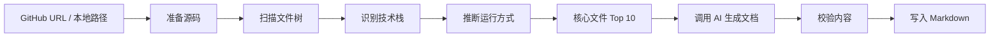

<div align="center">

# 📖 SourceGuide

**把任意 GitHub 仓库变成源码学习路线**

<p>
  <a href="https://github.com/liduanchen/SourceGuide/actions">
    
  </a>
  <a href="https://pypi.org/project/sourceguide/">
    
  </a>
  <a href="https://pypi.org/project/sourceguide/">
    
  </a>
  <a href="LICENSE">
    
  </a>
</p>

<p>
  <b>中文</b> · <a href="#features">功能</a> · <a href="#quick-start">快速开始</a> · <a href="#usage">用法</a> · <a href="#how-it-works">原理</a> · <a href="#roadmap">路线图</a>
</p>

<br>

[✨ 在线体验](https://github.com/liduanchen/SourceGuide) &nbsp;|&nbsp; [📖 查看输出示例](examples/README.md) &nbsp;|&nbsp; [🤝 贡献指南](CONTRIBUTING.md)

</div>

---

## 🎯 这是什么？

SourceGuide 是一个面向中文开发者的开源 CLI 工具。你**给它一个 GitHub 仓库地址或本地项目目录**，它会自动分析项目结构、识别技术栈、推断运行方式、找出核心文件，然后生成一组**适合阅读和分享的源码学习路线**。

> **它不是 README 总结器。** 同一个仓库，不同目的的人应该有不同读法。

## ✨ 功能

- 📦 支持**公开 GitHub 仓库 URL** 和**本地项目目录**
- 🧠 自动识别 **Python、Node.js、Go、Rust、Java、Docker** 等常见技术栈
- 🔍 自动推断**安装、启动、测试和 lint** 命令
- 🏆 自动生成**核心文件 Top 10** 和推荐阅读顺序
- 🔌 支持 **OpenAI 兼容 API**（可接入任意 LLM）
- 🌏 默认**中文输出**，支持单条/全部路线生成
- ⚙️ 环境变量配置，适合本地开发和 CI
- 📝 **Markdown-first**，方便放入 GitHub、掘金、知乎或文档站

## 🚀 快速开始

### 前提条件

- Python 3.9+
- 一个 OpenAI 兼容 API Key

### 安装

```bash
git clone https://github.com/liduanchen/SourceGuide.git
cd SourceGuide
python -m venv .venv
```

**Windows PowerShell：**
```powershell
.\.venv\Scripts\Activate.ps1
pip install -e .
```

**macOS / Linux：**
```bash
source .venv/bin/activate
pip install -e .
```

验证安装：
```bash
sourceguide --help
```

### 配置 API Key

```bash
export OPENAI_API_KEY="sk-your-api-key"
```

Windows PowerShell 用户：
```powershell
$env:OPENAI_API_KEY = "sk-your-api-key"
```

> 💡 也可参考 [`.env.example`](.env.example) 配置文件。**不要把真实 API Key 提交到 GitHub。**

### 生成文档

**分析本地项目：**
```bash
sourceguide generate .
```

**分析公开 GitHub 仓库：**
```bash
sourceguide generate https://github.com/pallets/flask
```

就是这么简单！输出会默认生成到 `docs/sourceguide/` 目录下。

## 📄 生成内容

SourceGuide 会为每个仓库生成 **4 条学习路线 + 若干参考文档**：

```
docs/sourceguide/
├── README.md                 ← 路线索引
├── 01-我是小白路线.md         ← 🟢 从零跑起来
├── 02-快速了解路线.md         ← 🔵 10 分钟判断价值
├── 03-贡献者路线.md           ← 🟣 参与开发入口
├── 04-项目面试路线.md         ← 🟠 简历/面试/分享
├── run-guide.md              ← 运行指南
├── source-map.md             ← 源码地图
├── architecture.md           ← 架构概览
├── glossary.md               ← 术语表
└── exercises.md              ← 练习题
```

每条路线都**必须包含"如何运行这个项目"**。如果运行方式无法自动确定，SourceGuide 会明确列出已发现的线索、可能的启动方式和排查建议。

## 📖 用法

```text
sourceguide generate <repo-or-path> [options]
```

| 选项 | 默认值 | 作用 |
| --- | --- | --- |
| `--route` | `all` | `all` / `beginner` / `quick` / `contributor` / `interview` |
| `--output` | `docs/sourceguide` | 输出目录 |
| `--model` | `gpt-4.1-mini` | 模型名称 |
| `--base-url` | `https://api.openai.com/v1` | API 地址 |
| `--language` | `zh-CN` | 输出语言 |
| `--depth` | `normal` | 教程深度：`basic` / `normal` / `deep` |
| `--overwrite` | `false` | 覆盖已有输出 |

> CLI 参数优先级高于环境变量。

### 示例

```bash
# 只生成"快速了解"路线
sourceguide generate . --route quick --overwrite

# 指定输出目录
sourceguide generate . --output docs/sourceguide --overwrite

# 临时覆盖模型和 API 地址
sourceguide generate . --model gpt-4.1 --base-url https://api.example.com/v1
```

## ⚙️ 配置

| 变量 | 默认值 | 说明 |
| --- | --- | --- |
| `OPENAI_API_KEY` | — | **必填**。API Key |
| `OPENAI_BASE_URL` | `https://api.openai.com/v1` | OpenAI 兼容 API 地址 |
| `SOURCEGUIDE_MODEL` | `gpt-4.1-mini` | 默认模型 |
| `SOURCEGUIDE_LANGUAGE` | `zh-CN` | 输出语言 |
| `SOURCEGUIDE_OUTPUT_DIR` | `docs/sourceguide` | 默认输出目录 |
| `SOURCEGUIDE_DEPTH` | `normal` | 教程深度：`basic` / `normal` / `deep` |
| `SOURCEGUIDE_TIMEOUT` | `60` | API 超时（秒） |
| `SOURCEGUIDE_DEBUG` | `false` | 是否输出调试信息 |

## 🧠 原理

SourceGuide 的工作流程：



1. **准备** — 接收本地路径或 GitHub URL，必要时克隆仓库
2. **扫描** — 遍历文件树，过滤无关文件
3. **识别** — 识别 README、依赖文件、配置文件、入口文件、测试目录
4. **推断** — 识别技术栈，推断安装/启动/测试/lint 命令
5. **排序** — 识别核心文件 Top 10 并推荐阅读顺序
6. **生成** — 分阶段调用 AI 生成各路线文档
7. **校验** — 确保每条路线包含运行说明、引用真实文件
8. **输出** — 写入 Markdown 到目标目录

## 🧱 项目结构

```
src/sourceguide/
├── cli.py          # CLI 入口
├── config.py       # 环境变量配置
├── repository.py   # 本地目录和 GitHub 仓库准备
├── scanner.py      # 文件扫描
├── stack.py        # 技术栈识别
├── runtime.py      # 运行方式推断
├── core_files.py   # 核心文件识别
├── ai.py           # OpenAI 兼容 Provider
├── renderer.py     # 规则生成器和模板化输出
├── writer.py       # Markdown 写入
├── validators.py   # 输出校验
└── pipeline.py     # 主流程编排
```

## 🛠️ 开发

```bash
pip install -e ".[dev]"
pytest
```

当前测试覆盖：
- 环境变量读取
- GitHub URL 和本地路径识别
- 文件扫描忽略规则
- 技术栈识别
- 运行方式推断
- 核心文件排序
- Markdown 校验器
- Mock AI client 集成测试

## 🗺️ 路线图

| 版本 | 内容 |
| :--- | :--- |
| ✅ **v0.1 MVP** | CLI + 公开仓库 + 本地目录 + 中文 Markdown 输出 |
| 🔜 **v0.2** | `sourceguide.toml` 配置 + 自定义扫描规则 + 自定义模板 |
| 🔜 **v0.3** | 增量更新，只重写变化部分，保留用户手写补充 |
| 🔜 **v0.4** | GitHub Action，仓库更新后自动生成文档 |
| 🔜 **v0.5** | 多语言输出 + 私有仓库授权 + HTML 文档站 |
| 🔮 **v1.0** | 稳定 CLI/API + 插件化分析器 + 完善示例和发布文档 |

## 🤝 贡献

欢迎提交 Issue 和 Pull Request！建议优先贡献：

- 🧩 新技术栈识别规则
- 🎯 更准确的运行方式推断
- 📝 更自然的中文文档模板
- 📸 真实仓库生成示例
- 🧪 测试用 fixture 项目

提交 PR 前请运行：
```bash
pytest
```

完整说明见 [`CONTRIBUTING.md`](CONTRIBUTING.md)。

## 📄 许可证

[MIT](LICENSE) © duanmuzichen

---

<div align="center">

**如果这个项目对你有帮助，欢迎 ⭐ Star 支持！**

</div>
