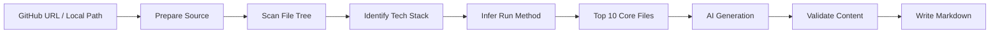

<div align="center">

[🇨🇳 中文](README.md) | [🇬🇧 English](README_EN.md)

---

# 📖 SourceGuide

**Turn any GitHub repository into guided source-code learning paths.**

<p>
  <a href="https://github.com/liduanchen/SourceGuide/actions">
    
  </a>
  <a href="https://github.com/liduanchen/SourceGuide/commits/master">
    
  </a>
  <a href="https://github.com/liduanchen/SourceGuide">
    
  </a>
  <a href="https://github.com/liduanchen/SourceGuide">
    
  </a>
  <a href="LICENSE">
    
  </a>
</p>

<p>
  <a href="#features">Features</a> ·
  <a href="#quick-start">Quick Start</a> ·
  <a href="#usage">Usage</a> ·
  <a href="#how-it-works">How It Works</a> ·
  <a href="#roadmap">Roadmap</a>
</p>

<br>

[✨ Try Online](https://codespaces.new/liduanchen/SourceGuide) &nbsp;|&nbsp; [📖 View Examples](examples/README.md) &nbsp;|&nbsp; [🤝 Contributing](CONTRIBUTING_EN.md)

</div>

---

## 🎯 What is SourceGuide?

SourceGuide is an open-source CLI tool for developers. Give it a **GitHub repository URL or a local project directory**, and it automatically analyzes the project structure, identifies the tech stack, infers how to run it, finds the core files, and generates a set of **guided learning paths** in Markdown.

> **It's not a README summarizer.** The same repository should be read differently by people with different goals.

## ✨ Features

- 📦 Supports **public GitHub repos** and **local project directories**
- 🧠 Auto-detects **Python, Node.js, Go, Rust, Java, Docker** and more
- 🔍 Infers **install, run, test, and lint** commands automatically
- 🏆 Ranks **Top 10 core files** with recommended reading order
- 🔌 Works with **any OpenAI-compatible API** (bring your own LLM)
- 🌏 Defaults to **Chinese output** with single-route or all-route generation
- ⚙️ Environment-variable based config for local dev and CI
- 📝 **Markdown-first** — ready for GitHub, 掘金, 知乎, or doc sites

## 🚀 Quick Start

### Prerequisites

- Python 3.9+
- An OpenAI-compatible API key

### Try Online

Click [✨ Try Online](https://codespaces.new/liduanchen/SourceGuide) to open a GitHub Codespaces development environment. Once it is ready, run:

```bash
sourceguide --help
sourceguide generate . --route quick --offline --output demo/sourceguide --overwrite
```

`--offline` uses the rule-based generator for a no-key demo. Real AI generation still requires `OPENAI_API_KEY`.

### Installation

```bash
git clone https://github.com/liduanchen/SourceGuide.git
cd SourceGuide
python -m venv .venv
```

**Windows PowerShell:**
```powershell
.\.venv\Scripts\Activate.ps1
pip install -e .
```

**macOS / Linux:**
```bash
source .venv/bin/activate
pip install -e .
```

Verify it works:
```bash
sourceguide --help
```

### Configure API Key

```bash
export OPENAI_API_KEY="sk-your-api-key"
```

PowerShell:
```powershell
$env:OPENAI_API_KEY = "sk-your-api-key"
```

> 💡 See [`.env.example`](.env.example) for reference. **Never commit real API keys to GitHub.**

### Generate Docs

**Analyze a local project:**
```bash
sourceguide generate .
```

**Analyze a public GitHub repo:**
```bash
sourceguide generate https://github.com/pallets/flask
```

That's it! Output is written to `docs/sourceguide/` by default.

## 📄 Generated Content

SourceGuide produces **4 learning paths + supporting docs**:

```
docs/sourceguide/
├── README.md                 ← Path index
├── 01-beginner-path.md       ← 🟢 Run from scratch
├── 02-quick-overview.md      ← 🔵 10-min assessment
├── 03-contributor-path.md    ← 🟣 Dev onboarding
├── 04-interview-path.md      ← 🟠 Resume & sharing
├── run-guide.md              ← Run instructions
├── source-map.md             ← Source map
├── architecture.md           ← Architecture overview
├── glossary.md               ← Terminology
└── exercises.md              ← Practice tasks
```

Every path **must include "how to run this project"**. If the run method can't be determined automatically, SourceGuide lists the clues found, possible start methods, and troubleshooting suggestions.

## 📖 Usage

```
sourceguide generate <repo-or-path> [options]
```

| Option | Default | Description |
| --- | --- | --- |
| `--route` | `all` | `all` / `beginner` / `quick` / `contributor` / `interview` |
| `--output` | `docs/sourceguide` | Output directory |
| `--model` | `gpt-4.1-mini` | Model name |
| `--base-url` | `https://api.openai.com/v1` | API base URL |
| `--language` | `zh-CN` | Output language |
| `--depth` | `normal` | Depth: `basic` / `normal` / `deep` |
| `--overwrite` | `false` | Overwrite existing output |
| `--offline` | `false` | Use the rule-based generator without calling an AI API |

> CLI flags take precedence over environment variables.

### Examples

```bash
# Generate only the quick-overview path
sourceguide generate . --route quick --overwrite

# Specify output directory
sourceguide generate . --output docs/sourceguide --overwrite

# Override model and API URL
sourceguide generate . --model gpt-4.1 --base-url https://api.example.com/v1

# Try generation without an API key
sourceguide generate . --route quick --offline --output demo/sourceguide --overwrite
```

## ⚙️ Configuration

| Variable | Default | Description |
| --- | --- | --- |
| `OPENAI_API_KEY` | — | **Required.** API key |
| `OPENAI_BASE_URL` | `https://api.openai.com/v1` | OpenAI-compatible API endpoint |
| `SOURCEGUIDE_MODEL` | `gpt-4.1-mini` | Default model |
| `SOURCEGUIDE_LANGUAGE` | `zh-CN` | Output language |
| `SOURCEGUIDE_OUTPUT_DIR` | `docs/sourceguide` | Default output dir |
| `SOURCEGUIDE_DEPTH` | `normal` | Depth: `basic` / `normal` / `deep` |
| `SOURCEGUIDE_TIMEOUT` | `60` | API timeout (seconds) |
| `SOURCEGUIDE_DEBUG` | `false` | Debug output |

## 🧠 How It Works



1. **Prepare** — Accept a local path or GitHub URL; clone if needed
2. **Scan** — Walk the file tree, filter out irrelevant files
3. **Identify** — Detect README, dependency files, configs, entry points, test dirs
4. **Infer** — Recognize tech stack, deduce install/run/test/lint commands
5. **Rank** — Identify Top 10 core files with recommended reading order
6. **Generate** — Call AI in stages to produce each learning path
7. **Validate** — Ensure every path includes run instructions and references real files
8. **Output** — Write Markdown to the target directory

## 🧱 Project Structure

```
src/sourceguide/
├── cli.py          # CLI entry point
├── config.py       # Environment variable config
├── repository.py   # Local & GitHub repo preparation
├── scanner.py      # File scanning
├── stack.py        # Tech stack detection
├── runtime.py      # Run method inference
├── core_files.py   # Core file identification
├── ai.py           # OpenAI-compatible provider
├── renderer.py     # Rule-based generator & templating
├── writer.py       # Markdown writer
├── validators.py   # Output validation
└── pipeline.py     # Main orchestration
```

## 🛠️ Development

```bash
pip install -e ".[dev]"
pytest
```

Test coverage includes:
- Environment variable parsing
- GitHub URL and local path recognition
- File scan ignore rules
- Tech stack detection
- Run method inference
- Core file ranking
- Markdown validation
- Mock AI integration tests

## 🗺️ Roadmap

| Version | Content |
| :--- | :--- |
| ✅ **v0.1 MVP** | CLI + public repos + local dirs + Chinese Markdown output |
| 🔜 **v0.2** | `sourceguide.toml` config + custom scan rules + custom templates |
| 🔜 **v0.3** | Incremental updates — only regenerate changed docs, preserve manual edits |
| 🔜 **v0.4** | GitHub Action — auto-generate docs on repo updates |
| 🔜 **v0.5** | Multi-language + private repo support + HTML doc site |
| 🔮 **v1.0** | Stable CLI/API + plugin analyzers + polished examples & docs |

## 🤝 Contributing

Issues and Pull Requests are welcome! Priority contributions:

- 🧩 New tech stack detection rules
- 🎯 More accurate run method inference
- 📝 Better document templates
- 📸 Real-world repository examples
- 🧪 Test fixture projects

Please run before submitting a PR:
```bash
pytest
```

See [`CONTRIBUTING.md`](CONTRIBUTING_EN.md) for full details.

## 📄 License

[MIT](LICENSE) © duanmuzichen

---

<div align="center">

**If this project helps you, give it a ⭐!**

</div>
